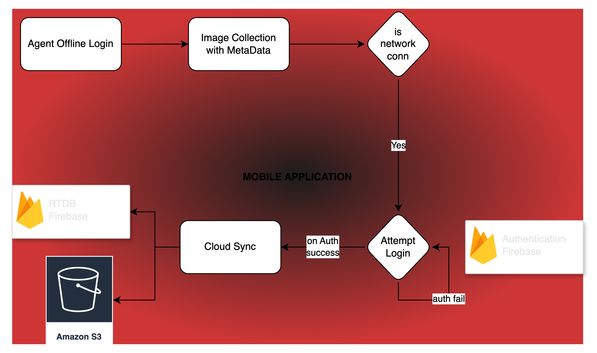

# Artemis Mobile app for Data collection and image sync.

## Demo Video

### Improvements to be Done:
- App is designed to have a offline first approach and demand online auth only when network is available.
- Gallery UI is now run on a long task with no UI thread so page refresh is required to update the status.
- Inclusion of Secret manager will improve security aspects - Currently S3 keys are fetched from Firebase RTDB only in runtime keys are available.